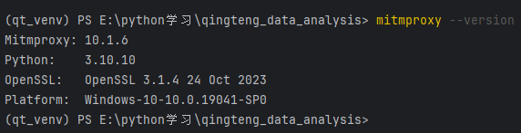
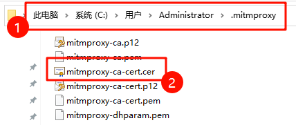
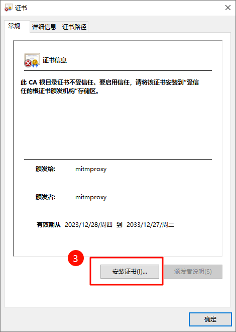
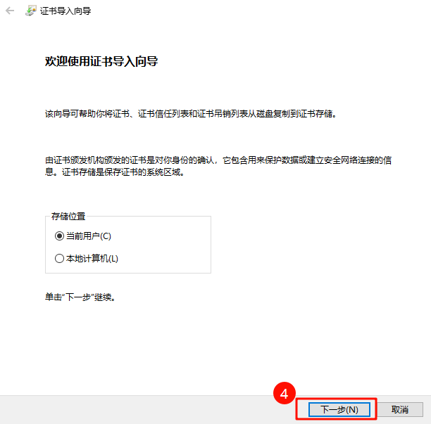
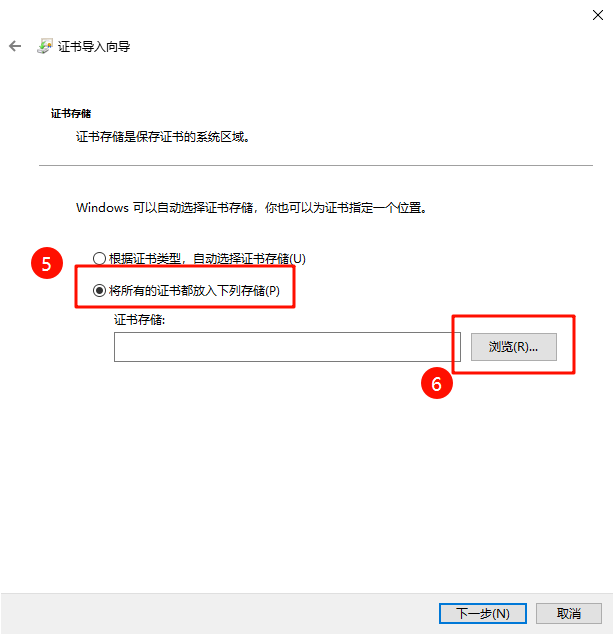
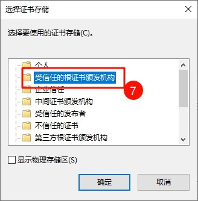
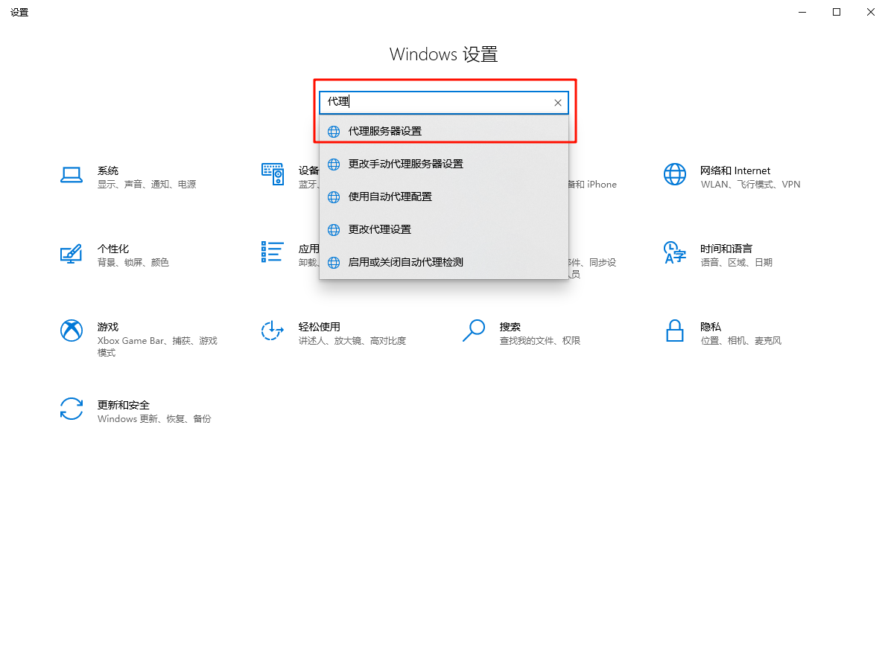
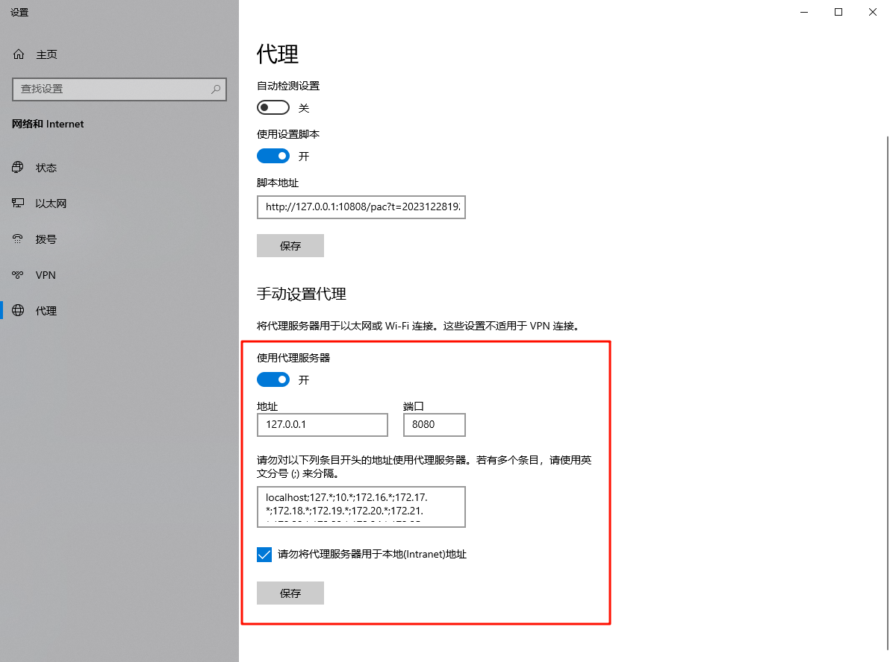
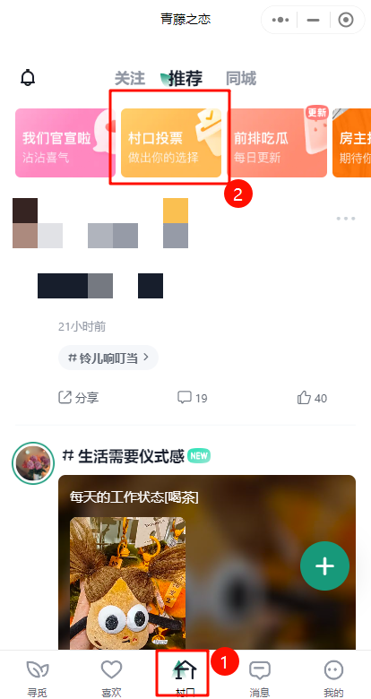

# 项目说明

## 重要声明

本项目主要基于青藤之恋匿名投票贴评论数据，分析当代年情人赛博相亲时，对有关异地恋、彩礼、性别对立等话题的思考。基于大样本数据，全面剖析当代年轻人的恋爱观和婚姻观。本项目仅供学习交流使用，请勿用于商业用途，否则后果自负。

## 项目介绍

本项目数据基于Mitmproxy中间人攻击和微信PC端小程序抓包获取，所有数据经过脱敏处理，仅包含项目分析所需基本字段，不包含个人隐私信息。

## 项目进度

- [x] 框架搭建
- [x] 数据获取
- [x] 数据清洗
- [ ] 数据分析
- [ ] 数据可视化

## 数据获取

### 微信小程序抓包

Mitmproxy中间人攻击是一种网络代理工具，可以截获和修改网络请求和响应。

1. 安装Mitmproxy

```bash
pip install mitmproxy
```

安装完成后，可以使用`mitmproxy --version`查看是否安装成功。


2. 安转mitmproxy-ca证书

- 打开终端，输入以下命令：`mitmproxy`，启动后，会在当前用户目录下生成一个`.mitmproxy`
  文件夹，进入该文件夹，点击`mitmproxy-ca-cert.cer`文件进行安装。







]



### 数据获取

1. 进入script目录，在终端中运行`mitmdump -s get_data.py -q`。

2. 开启代理

- 在设置中搜索`代理`，点击代理服务器设置。



- 点击`手动代理`，输入`127.0.0.1`和`8080`端口，点击`保存`。



3. 进入微信小程序，点击`村口` -> `村口投票`



4. 点击相关投票贴，滑动到底，即可完成数据采集，请注意控制滑动速度，滑动速度过快会被临时封禁。

5. 采集完成后，关闭终端，关闭手动代理，数据保存到`data`目录下。

## 结语

欢迎您使用本项目对自己感兴趣的话题进行数据分析，如果您有任何问题，欢迎在Issues中联系我。


